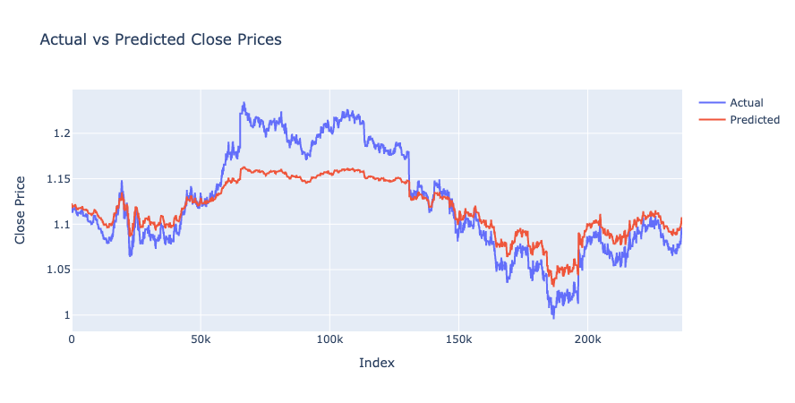

# Forex Price Forecasting Using Recurrent Neural Networks (RNNs): A Quantitative Approach

This project employs Recurrent Neural Networks (RNNs), specifically Long Short-Term Memory (LSTM) networks, to forecast foreign exchange (Forex) prices. RNNs are highly effective for sequence prediction problems due to their ability to remember past information. This feature is particularly useful in time-series forecasting, such as Forex price prediction.



## Libraries and Tools

- `numpy`: For numerical operations and manipulations.
- `pandas`: For data loading and preprocessing.
- `matplotlib` and `plotly`: For data visualization.
- `scikit-learn`: For data scaling and transformations.
- `tensorflow`: For implementing and training the RNN.

## Data Preprocessing and Feature Engineering

### Data Loading

The dataset spans from 2020 to 2023 and contains various attributes such as opening, highest, lowest, and closing prices for specific time intervals.

### Min-Max Scaling

Before feeding the data into the RNN model, the features are normalized using Min-Max scaling, expressed as:

\[
X_{\text{scaled}} = \frac{X - X_{\text{min}}}{X_{\text{max}} - X_{\text{min}}}
\]

where \(X\) is the original feature vector, \(X_{\text{min}}\) and \(X_{\text{max}}\) are the minimum and maximum values of the feature vector, respectively.

### Sequence Generation

The time-series data is transformed into sequences \( S = \{s_1, s_2, \ldots, s_{T}\} \) where each sequence \( s_t \) consists of 60 time steps.

## Model Architecture and Mathematical Formulation

### LSTM Architecture

The LSTM architecture consists of three sequential LSTM layers followed by a dense output layer. The LSTM layers aim to capture the temporal dependencies of the Forex prices.

### Mathematical Representation

The LSTM cell can be mathematically represented by the following equations:

\[
f_t = \sigma(W_f \cdot [h_{t-1}, x_t] + b_f)
\]
\[
i_t = \sigma(W_i \cdot [h_{t-1}, x_t] + b_i)
\]
\[
\tilde{C}_t = \tanh(W_C \cdot [h_{t-1}, x_t] + b_C)
\]
\[
C_t = f_t \times C_{t-1} + i_t \times \tilde{C}_t
\]
\[
o_t = \sigma(W_o \cdot [h_{t-1}, x_t] + b_o)
\]
\[
h_t = o_t \times \tanh(C_t)
\]

Here, \( f_t, i_t, o_t \) are the forget, input, and output gates, respectively. \( \tilde{C}_t \) and \( C_t \) are the candidate and final cell states, and \( h_t \) is the hidden state. \( W \) and \( b \) are learnable parameters.

## Evaluation Metrics and Results

The model performance is evaluated using Mean Squared Error (MSE), expressed as:

\[
\text{MSE} = \frac{1}{n} \sum_{i=1}^{n} (y_{\text{true},i} - y_{\text{pred},i})^2
\]

## Interactive Data Visualization

An interactive Plotly graph is used for the visualization, enabling detailed analysis by zooming, panning, and hovering over the data points.

## Code Implementation

To run the code, ensure you have a well-structured CSV file with Forex data, and update the `file_path` in the code to point to your dataset.

To install the required Python packages, execute:

```bash
pip install numpy pandas matplotlib plotly scikit-learn tensorflow
