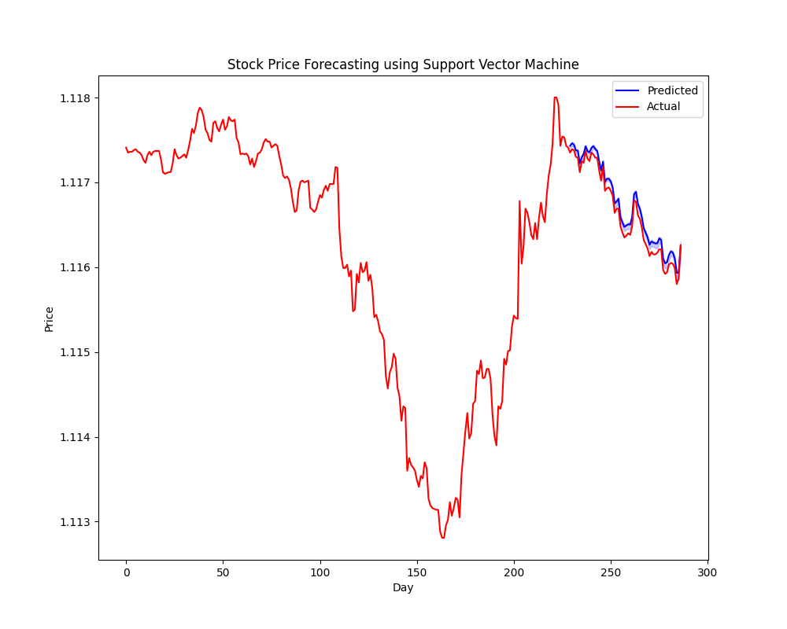

# Forex Price Forecasting: An Advanced Approach Using Recurrent Neural Networks (RNNs)

This project aims to predict stock prices using Support Vector Regression (SVR) with bootstrapping to generate prediction intervals.

## Libraries Used

The following libraries are used in this project:

- `numpy` and `pandas` for data handling and manipulation.
- `matplotlib` for data visualization.
- `sklearn` for machine learning model building and preprocessing of data.
- `sklearn.utils.resample` for generating bootstrap samples.

## Data Loading and Preprocessing

The data is taken from Forex trade Dataset (2020-2023). The data includes stock prices for a given day, where the `X` variable represents the features (input data), and the `y` variable represents the target (output data). The features are standardized using the `StandardScaler` from `sklearn.preprocessing`. The data is then split into training and test sets.

## Model Building and Bootstrapping

I use a SVR model with a radial basis function (RBF) kernel. The model is trained on bootstrap samples of the training data. For each bootstrap sample, the model's predictions on the test set are stored. This process is repeated for a specified number of bootstrap samples (in this case, 1000).

## Prediction Intervals

The lower and upper bounds of the prediction intervals are calculated by taking the 2.5th and 97.5th percentiles of the bootstrap predictions, respectively. These bounds are then transformed back to the original scale of the target variable.

## Visualization

The predictions, along with the prediction intervals, are visualized using `matplotlib`. The visualization includes the actual prices (in red) and the predicted prices (in blue) with the prediction intervals shaded in blue.

## Code Usage

To use the code, you need to provide a CSV file with your data. The CSV file should be structured such that the first column contains the date, the next three columns contain the features (input data), and the last column contains the target variable (stock prices). Modify the path in the code to point to your CSV file.

Please ensure that you have the necessary Python libraries installed in your environment. If not, you can install them using pip:

